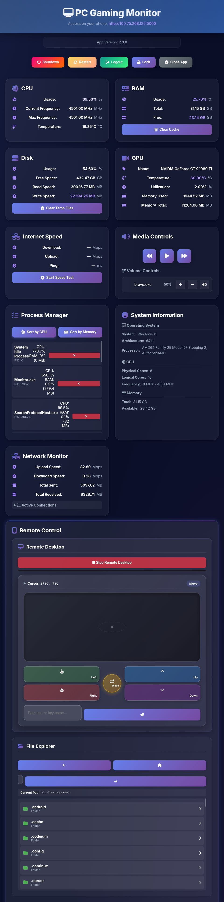

# PC Gaming Monitor - Enhanced Edition 🚀

A modern, feature-rich system monitoring application that allows you to monitor your PC's performance metrics in real-time from any device on your network.

## 🖥️ Screenshots



## ✨ What's New in v2.0

### Backend Improvements
- **Better Error Handling**: Comprehensive error handling with custom exception classes
- **Structured Logging**: Professional logging system with file and console output
- **Performance Optimization**: Metrics caching system to reduce CPU load
- **Code Organization**: Modular structure with separate utilities and configuration
- **API Improvements**: Better response formatting and error messages
- **Security**: Improved input validation and error handling

### Frontend Improvements
- **Modern UI Design**: Beautiful gradient-based design with glassmorphism effects
- **Smooth Animations**: Fluid transitions and hover effects
- **Better UX**: Improved loading states, success/error messages
- **Responsive Design**: Optimized for mobile, tablet, and desktop
- **Dark Theme**: Modern dark color scheme with accent colors
- **Enhanced Visuals**: Better typography, spacing, and visual hierarchy

### Code Quality
- **Modern JavaScript**: ES6+ features, async/await, proper error handling
- **Better Structure**: Organized code with clear separation of concerns
- **Performance**: Optimized API calls and reduced unnecessary updates
- **Maintainability**: Clean, documented code that's easy to extend

## 🎯 Features

### System Monitoring
- **CPU**: Usage, frequency, temperature
- **RAM**: Usage, total, free memory
- **Disk**: Usage, free space, read/write speeds
- **GPU**: Name, temperature, utilization, memory usage
- **Network**: Internet speed test (download, upload, ping)

### System Controls
- Shutdown system
- Restart system
- Logout user
- Lock workstation
- Clear system cache
- Clear temporary files

### Media Controls
- Play/Pause media
- Previous/Next track
- Per-application volume control
- Mute/Unmute individual apps

### Additional Features
- Real-time metric updates (1 second intervals)
- Automatic update checking
- Mobile-friendly interface
- Beautiful, modern UI

## 📋 Requirements

- Python 3.8+
- Windows 10/11 (for system controls)
- Administrator privileges (for some features)

## 🚀 Installation

1. Install dependencies:
```bash
pip install -r requirements.txt
```

**Note:** If `pythonnet` fails to install (common on Windows), the app will still run but with limited GPU/CPU temperature monitoring. To install pythonnet on Windows:
- Option 1: Use a pre-built wheel: `pip install pythonnet --only-binary :all:`
- Option 2: Install Visual Studio Build Tools and try again
- Option 3: The app will work without it, just showing "Unavailable" for temperature readings

2. Run the application:
```bash
python Monitor.py
```

3. Access the web interface:
   - On your PC: `http://localhost:5000`
   - On your phone: `http://<your-ip>:5000`

## 📁 Project Structure

```
PC-Gaming-App/
├── Monitor.py              # Main Flask application
├── config.py               # Configuration management
├── cpu.py                  # CPU monitoring module
├── ram.py                  # RAM monitoring module
├── gpu.py                  # GPU monitoring module
├── disk.py                 # Disk monitoring module
├── media.py                # Media control module
├── icon.py                 # Icon mapping
├── updater.py              # Update system
├── utils/                  # Utility modules
│   ├── logger.py           # Logging system
│   ├── cache.py            # Metrics caching
│   └── errors.py           # Error handling
├── static/                 # Static files
│   ├── style.css           # Modern CSS styling
│   └── script.js           # Enhanced JavaScript
├── templates/              # HTML templates
│   └── index.html          # Main page
└── lib/                    # External libraries
```

## 🎨 Design Philosophy

The new design focuses on:
- **Modern Aesthetics**: Gradient backgrounds, glassmorphism, smooth animations
- **User Experience**: Clear visual feedback, intuitive controls, responsive layout
- **Performance**: Optimized rendering, efficient API calls, smart caching
- **Accessibility**: Clear typography, good contrast, mobile-friendly

## 🔧 Configuration

Edit `config.py` to customize:
- Server host and port
- Update intervals
- Cache TTL
- Logging levels

## 📝 Logging

Logs are saved to `logs/app.log` with detailed information about:
- API requests
- Errors and exceptions
- System events
- Performance metrics

## 🐛 Troubleshooting

### Metrics not updating
- Check if you have administrator privileges
- Verify hardware monitoring DLLs are present in `lib/` folder
- Check logs for error messages

### Audio controls not working
- Ensure Windows audio services are running
- Check if applications are producing audio
- Verify pycaw library is installed correctly

### Speed test fails
- Check internet connection
- Ensure speedtest-cli is installed
- Some networks may block speed test servers

## 🔒 Security Notes

- The app runs on your local network (0.0.0.0)
- System control features require administrator privileges
- Only use on trusted networks
- Consider adding authentication for production use

## 📄 License

See LICENSE file for details.

## 🙏 Credits

Built with:
- Flask - Web framework
- psutil - System monitoring
- OpenHardwareMonitor - Hardware metrics
- Font Awesome - Icons
- Google Fonts (Inter) - Typography

## 🚧 Future Enhancements

- [ ] Real-time charts and graphs
- [ ] Historical data tracking
- [ ] Alert system for high temperatures/usage
- [ ] Customizable themes
- [ ] Multi-language support
- [ ] Authentication system
- [ ] WebSocket for real-time updates

---

**Version**: 2.0.0  
**Last Updated**: 2024
